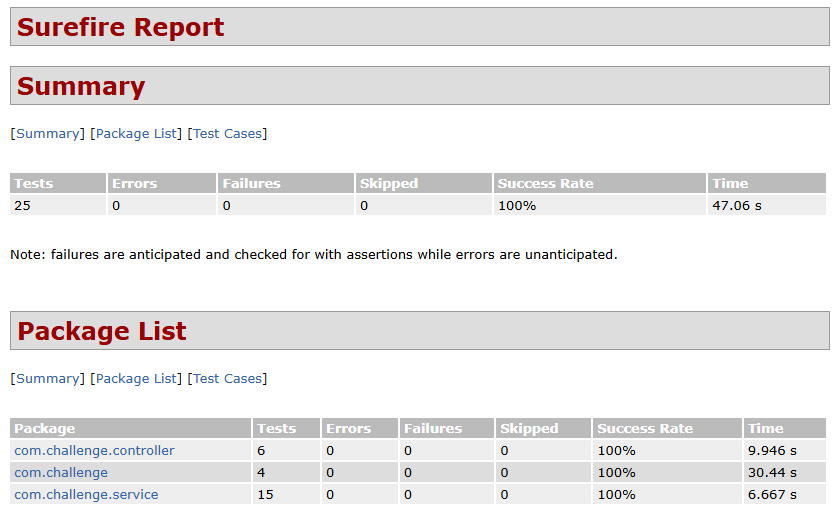

# Challenge Backend

[](https://openjdk.java.net/)
[](https://spring.io/projects/spring-boot)
[](https://www.postgresql.org/)
[](https://www.docker.com/)

## 🚀 Descripción

API REST desarrollada con Spring Boot que implementa un sistema de cálculo con porcentaje dinámico, incluyendo caché inteligente, historial de llamadas asíncrono y documentación.

## 🚦 Inicio Rápido

### Prerrequisitos

- Docker 20.10+ y Docker Compose
- Java 21+ (solo para desarrollo local)

### 🐳 Ejecución con Docker (Recomendado)

1. **Clonar el repositorio**
   ```bash
   git clone https://github.com/ruthgutierrez17/spring-boot-challenge.git
   cd spring-boot-challenge
   ```

2. **Levantar toda la infraestructura**
   ```bash
   docker-compose up -d
   ```

3. **Verificar que todos los servicios estén funcionando**
   ```bash
   docker-compose ps
   ```

4. **Acceder a la aplicación**
   - Swagger UI: http://localhost:8080/swagger-ui.html
   - OpenAPI JSON: http://localhost:8080/v3/api-docs
   - Health Check: http://localhost:8080/actuator/health

### 🔧 Desarrollo Local

1. **Configurar infraestructura (base de datos y mock service)**
   ```bash
   docker-compose up postgres percentage-service -d
   ```

2. **Ejecutar la aplicación**
   ```bash
   ./mvnw spring-boot:run
   ```

### 🏗️ Arquitectura

**Patrón de Capas con Separación de Responsabilidades:**

- **Controller**: Manejo de HTTP requests/responses y validación
- **Service**: Lógica de negocio y orquestación
- **Repository**: Acceso a datos con Spring Data JPA
- **Cache**: Caffeine para optimización de consultas externas
- **DTOs**: Transferencia de datos controlada y validada
- **Configuration**: Configuración externalizada y basada en perfiles

**Flujo Principal:**
```
HTTP Request → Controller → Service → Cache/External API → Database → Response
```

## 🛠️ Stack Tecnológico

**Core:**
- Java 21, Spring Boot 3.3.3, Spring Data JPA
- PostgreSQL 16, Caffeine Cache, Spring WebFlux

**Testing:**
- JUnit 5, Mockito, TestContainers, WireMock

**DevOps:**
- Docker, OpenAPI/Swagger, Spring Actuator

## 🧪 Testing

### Cobertura de Tests

- **Pruebas Unitarias**: Tests unitarios para servicios y controladores
- **Pruebas de integración**: integración con servicios externos y base de datos containerizada



### Ejecutar Tests

```bash
# Tests unitarios
./mvnw test

# Tests de integración
./mvnw verify

```

## 📊 Monitoreo y Observabilidad

### Endpoints de Actuator

- **Health**: `/actuator/health`
- **Métricas**: `/actuator/metrics`
- **Prometheus**: `/actuator/prometheus`
- **Cache**: `/actuator/caches`

### Logs Estructurados

```bash
# Ver logs en tiempo real
docker-compose logs -f calculation-api | tail -n 100

# Ver logs de base de datos
docker-compose logs postgres | tail -n 100

# Ver logs del mock service
docker-compose logs percentage-service | tail -n 100
```

---

**Desarrollado con ❤️ para el Challenge Backend 2025**
